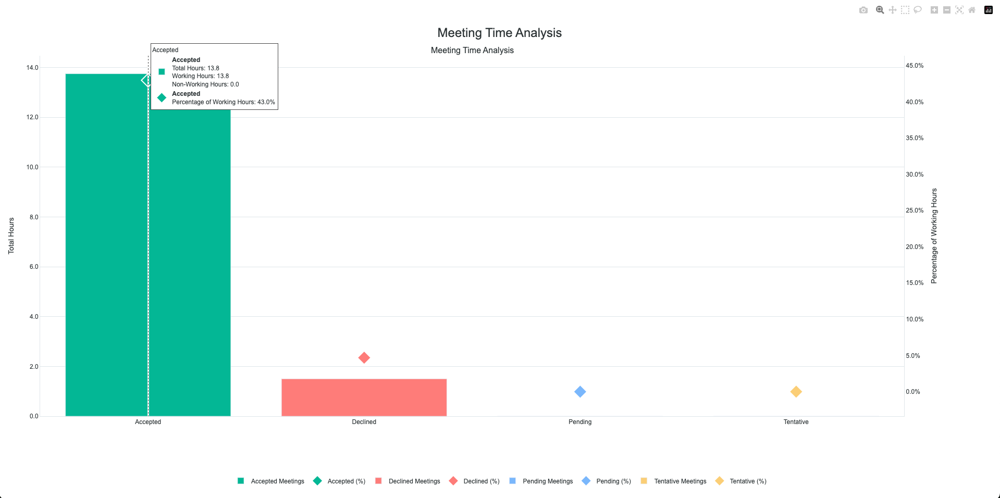

# Google Calendar Meeting Analyzer

This Python application analyzes your Google Calendar meetings within a specified time window and visualizes how your time is spent in meetings relative to working hours.

## Screenshot



## Features

- Analyzes meetings within a specified date range
- Calculates meeting time as a percentage of working hours
- Separates analysis by meeting response status (accepted, declined, not responded, tentative)
- Visualizes results using interactive Plotly graphs
- Distinguishes between working hours (9 AM - 6 PM) and non-working hours
- Considers Sunday-Thursday as working days

## Setup

1. Install the required dependencies:
```bash
pip install -r requirements.txt
```

2. Set up Google Calendar API:
   - Go to the [Google Cloud Console](https://console.cloud.google.com/)
   - Create a new project
   - Enable the Google Calendar API
   - Create credentials (OAuth 2.0 Client ID)
   - Download the credentials and save them as `credentials.json` in the project directory

## Usage

The script can be run from the command line with start and end dates as arguments:

```bash
# Using long form arguments
python calendar_analyzer.py --start 2024-01-01 --end 2024-03-01

# Using short form arguments
python calendar_analyzer.py -s 2024-01-01 -e 2024-03-01
```

### Command Line Arguments

- `--start` or `-s`: Start date in YYYY-MM-DD format
- `--end` or `-e`: End date in YYYY-MM-DD format

### Examples

1. Analyze the last month:
```bash
python calendar_analyzer.py -s 2024-02-01 -e 2024-03-01
```

2. Analyze the current quarter:
```bash
python calendar_analyzer.py -s 2024-01-01 -e 2024-03-31
```

### Visualization

The script generates an interactive visualization showing:
- Total hours spent in meetings by response status (bars)
- Percentage of working hours consumed by meetings (diamond markers)
- Breakdown of meetings during/outside working hours (hover information)

Each meeting status is color-coded:
- Accepted meetings: Fresh mint green
- Declined meetings: Soft red
- Pending meetings: Soft blue
- Tentative meetings: Warm yellow

## Customizing Working Hours and Days

You can customize the working hours and days by modifying two functions in `calendar_analyzer.py`:

1. To change working hours, modify the `is_working_hours` function:
```python
def is_working_hours(event_start):
    """Check if event is during working hours (9 AM - 6 PM)"""
    hour = event_start.hour
    return 9 <= hour < 18  # Change these numbers to adjust working hours
```

2. To change working days, modify the `is_working_day` function:
```python
def is_working_day(event_date):
    """Check if event is on a working day (Sunday-Thursday)"""
    return event_date.weekday() < 5  # Adjust this logic for different working days
```

Weekday numbers in Python:
- 0 = Monday
- 1 = Tuesday
- 2 = Wednesday
- 3 = Thursday
- 4 = Friday
- 5 = Saturday
- 6 = Sunday

For example, to change to Monday-Friday working days:
```python
def is_working_day(event_date):
    """Check if event is on a working day (Monday-Friday)"""
    return 0 <= event_date.weekday() <= 4
```

Remember to also update the working hours per day in `calculate_meeting_metrics` if you change the working hours:
```python
working_hours_per_day = 9  # Change this to match your working hours range
```

## Notes

- Working hours are defined as 9 AM - 6 PM
- Working days are Sunday through Thursday
- All-day events are excluded from the analysis
- The visualization is interactive and can be saved as HTML or image files
- First run will require Google Calendar authentication # google-calendar-analyzer
